# 📦 Gestión de Dependencias - Aeromexico AI League 2025

## 📋 Estrategia de Dependencias

### Filosofía de Gestión

- **Minimalismo**: Solo dependencias necesarias
- **Estabilidad**: Preferir versiones LTS y estables
- **Seguridad**: Auditorías regulares y actualizaciones de seguridad
- **Performance**: Evitar dependencias pesadas innecesarias
- **Compatibilidad**: Mantener compatibilidad con Angular y TypeScript

## 📊 Inventario de Dependencias

### Dependencias de Producción

```json
{
  "@angular/animations": "^19.2.15",
  "@angular/common": "^19.2.0",
  "@angular/compiler": "^19.2.0",
  "@angular/core": "^19.2.0",
  "@angular/forms": "^19.2.0",
  "@angular/platform-browser": "^19.2.0",
  "@angular/platform-browser-dynamic": "^19.2.0",
  "@angular/platform-server": "^19.2.0",
  "@angular/router": "^19.2.0",
  "@angular/ssr": "^19.2.17",
  "express": "^4.18.2",
  "rxjs": "~7.8.0",
  "tslib": "^2.3.0",
  "zone.js": "~0.15.0"
}
```

### Dependencias de Desarrollo

```json
{
  "@angular-devkit/build-angular": "^19.2.17",
  "@angular/cli": "^19.2.17",
  "@angular/compiler-cli": "^19.2.0",
  "@types/express": "^4.17.17",
  "@types/jasmine": "~5.1.0",
  "@types/node": "^18.18.0",
  "jasmine-core": "~5.6.0",
  "karma": "~6.4.0",
  "karma-chrome-launcher": "~3.2.0",
  "karma-coverage": "~2.2.0",
  "karma-jasmine": "~5.1.0",
  "karma-jasmine-html-reporter": "~2.1.0",
  "typescript": "~5.7.2"
}
```

## 🔄 Proceso de Actualización

### Auditoría Regular

```bash
# Verificar dependencias desactualizadas
npm outdated

# Auditoría de seguridad
npm audit

# Auditoría con corrección automática
npm audit fix

# Auditoría forzada (cuidado con breaking changes)
npm audit fix --force
```

### Estrategia de Actualización por Tipo

#### 1. Actualizaciones de Seguridad (Inmediatas)

```bash
# Identificar vulnerabilidades críticas
npm audit --audit-level critical

# Aplicar parches de seguridad
npm audit fix

# Verificar que no se rompió nada
npm test
npm run build
```

#### 2. Actualizaciones Menores (Semanales)

```bash
# Ver actualizaciones menores disponibles
npm outdated --depth=0

# Actualizar dependencias menores
npm update

# Verificar funcionamiento
npm test
npm run e2e
```

#### 3. Actualizaciones Mayores (Mensuales/Trimestrales)

```bash
# Usar herramienta especializada
npm install -g npm-check-updates

# Ver actualizaciones mayores
ncu

# Actualizar package.json (sin instalar)
ncu -u

# Revisar cambios antes de instalar
git diff package.json

# Instalar y probar
npm install
npm test
npm run build
```

### Proceso de Actualización de Angular

```bash
# Usar Angular Update Guide
# https://update.angular.io/

# Actualizar Angular CLI globalmente
npm install -g @angular/cli@latest

# Actualizar proyecto Angular
ng update @angular/core @angular/cli

# Actualizar dependencias relacionadas
ng update @angular/material
ng update @angular/cdk

# Verificar compatibilidad
ng build --prod
npm test
```

## 🔒 Gestión de Seguridad

### Auditorías Automatizadas

```json
// package.json scripts
{
  "scripts": {
    "audit": "npm audit",
    "audit:fix": "npm audit fix",
    "audit:check": "npm audit --audit-level moderate",
    "security:check": "npm run audit && npm run test"
  }
}
```

### Configuración de Dependabot (GitHub)

```yaml
# .github/dependabot.yml
version: 2
updates:
  - package-ecosystem: "npm"
    directory: "/"
    schedule:
      interval: "weekly"
      day: "monday"
      time: "09:00"
    open-pull-requests-limit: 5
    reviewers:
      - "team-lead"
    assignees:
      - "security-team"
    commit-message:
      prefix: "deps"
      include: "scope"
```

### Políticas de Seguridad

```json
// .npmrc
audit-level=moderate
fund=false
save-exact=true
package-lock=true
```

## 📈 Monitoreo de Dependencias

### Herramientas de Análisis

```bash
# Analizar tamaño del bundle
npm install -g webpack-bundle-analyzer
ng build --stats-json
npx webpack-bundle-analyzer dist/am-ia-league/stats.json

# Analizar dependencias duplicadas
npm ls --depth=0
npm dedupe

# Verificar licencias
npm install -g license-checker
license-checker --summary
```

### Métricas de Dependencias

```bash
# Script para generar reporte de dependencias
#!/bin/bash
echo "📊 Reporte de Dependencias - $(date)"
echo "=================================="

echo "📦 Total de dependencias:"
npm ls --depth=0 --json | jq '.dependencies | length'

echo "🔒 Vulnerabilidades:"
npm audit --json | jq '.metadata.vulnerabilities'

echo "📅 Dependencias desactualizadas:"
npm outdated --json | jq 'keys | length'

echo "💾 Tamaño de node_modules:"
du -sh node_modules/

echo "🏷️ Licencias utilizadas:"
license-checker --summary --json | jq 'keys'
```

## 🎯 Optimización de Dependencias

### Tree Shaking

```typescript
// Importaciones específicas para mejor tree shaking
// ✅ Bueno
import { map, filter } from "rxjs/operators";
import { Observable } from "rxjs";

// ❌ Malo
import * as rxjs from "rxjs";
import { operators } from "rxjs";
```

### Lazy Loading de Dependencias

```typescript
// Carga diferida de librerías pesadas
async loadChartLibrary() {
  const { Chart } = await import('chart.js');
  return Chart;
}

// Dynamic imports en rutas
const routes: Routes = [
  {
    path: 'admin',
    loadComponent: () => import('./admin/admin.component')
      .then(m => m.AdminComponent)
  }
];
```

### Bundle Analysis

```json
// angular.json - configuración para análisis
{
  "build": {
    "configurations": {
      "analyze": {
        "buildOptimizer": true,
        "optimization": true,
        "statsJson": true,
        "namedChunks": true
      }
    }
  }
}
```

## 🔧 Herramientas de Gestión

### npm-check-updates

```bash
# Instalar globalmente
npm install -g npm-check-updates

# Verificar actualizaciones
ncu

# Actualizar package.json
ncu -u

# Actualizar solo dependencias específicas
ncu -f "@angular/*"

# Actualizar con filtros
ncu --target minor
ncu --target patch
```

### Yarn (Alternativa)

```bash
# Migrar de npm a yarn
yarn import

# Comandos equivalentes
yarn install     # npm install
yarn add package # npm install package
yarn upgrade     # npm update

# Auditoría con yarn
yarn audit
yarn audit --level moderate
```

### pnpm (Alternativa eficiente)

```bash
# Instalar pnpm
npm install -g pnpm

# Migrar proyecto
pnpm import

# Comandos básicos
pnpm install
pnpm add package
pnpm update

# Ventajas: espacio en disco, velocidad
```

## 📋 Políticas de Dependencias

### Criterios de Selección

1. **Mantenimiento Activo**

   - Commits recientes (< 6 meses)
   - Issues respondidos
   - Releases regulares

2. **Popularidad y Adopción**

   - Downloads semanales > 10k
   - GitHub stars > 1k
   - Usado por proyectos conocidos

3. **Calidad del Código**

   - Tests comprehensivos
   - Documentación clara
   - TypeScript support

4. **Compatibilidad**
   - Compatible con Angular 19
   - Compatible con TypeScript 5.7
   - Sin conflictos con otras deps

### Proceso de Aprobación

```mermaid
graph TD
    A[Propuesta de Dependencia] --> B[Evaluación Técnica]
    B --> C{Cumple Criterios?}
    C -->|Sí| D[Prueba en Rama]
    C -->|No| E[Rechazar]
    D --> F[Review de Código]
    F --> G{Tests Pasan?}
    G -->|Sí| H[Aprobar]
    G -->|No| I[Corregir]
    I --> F
```



## 🚨 Resolución de Conflictos

### Conflictos de Versiones

```bash
# Identificar conflictos
npm ls

# Resolver con resolutions (package.json)
{
  "resolutions": {
    "package-name": "^1.2.3"
  }
}

# O con overrides (npm 8.3+)
{
  "overrides": {
    "package-name": "^1.2.3"
  }
}
```

### Dependencias Peer

```bash
# Instalar peer dependencies manualmente
npm install --save-dev @types/node

# Verificar peer dependencies
npm ls --depth=0 2>&1 | grep "UNMET PEER DEPENDENCY"
```

### Lock File Conflicts

```bash
# Regenerar package-lock.json
rm package-lock.json node_modules -rf
npm install

# O usar npm ci para instalación limpia
npm ci
```

## 📊 Reportes y Métricas

### Reporte Semanal de Dependencias

```bash
#!/bin/bash
# weekly-deps-report.sh

DATE=$(date +"%Y-%m-%d")
REPORT_FILE="dependency-report-$DATE.md"

echo "# Reporte de Dependencias - $DATE" > $REPORT_FILE
echo "" >> $REPORT_FILE

echo "## Vulnerabilidades" >> $REPORT_FILE
npm audit --json | jq -r '.metadata.vulnerabilities | to_entries[] | "- \(.key): \(.value)"' >> $REPORT_FILE

echo "" >> $REPORT_FILE
echo "## Dependencias Desactualizadas" >> $REPORT_FILE
npm outdated --json | jq -r 'to_entries[] | "- \(.key): \(.value.current) → \(.value.latest)"' >> $REPORT_FILE

echo "" >> $REPORT_FILE
echo "## Tamaño del Bundle" >> $REPORT_FILE
npm run build:stats
echo "Ver archivo stats.json para detalles" >> $REPORT_FILE

echo "Reporte generado: $REPORT_FILE"
```

### Dashboard de Dependencias

```json
// scripts/dependency-dashboard.js
const fs = require('fs');
const { execSync } = require('child_process');

function generateDashboard() {
  const packageJson = JSON.parse(fs.readFileSync('package.json', 'utf8'));
  const audit = JSON.parse(execSync('npm audit --json', { encoding: 'utf8' }));

  const dashboard = {
    timestamp: new Date().toISOString(),
    totalDependencies: Object.keys(packageJson.dependencies || {}).length,
    totalDevDependencies: Object.keys(packageJson.devDependencies || {}).length,
    vulnerabilities: audit.metadata.vulnerabilities,
    outdated: JSON.parse(execSync('npm outdated --json', { encoding: 'utf8' }))
  };

  fs.writeFileSync('dependency-dashboard.json', JSON.stringify(dashboard, null, 2));
  console.log('Dashboard generado: dependency-dashboard.json');
}

generateDashboard();
```

## 🔄 Automatización

### GitHub Actions para Dependencias

```yaml
# .github/workflows/dependencies.yml
name: Dependency Management

on:
  schedule:
    - cron: "0 9 * * 1" # Lunes a las 9 AM
  workflow_dispatch:

jobs:
  audit:
    runs-on: ubuntu-latest
    steps:
      - uses: actions/checkout@v3
      - uses: actions/setup-node@v3
        with:
          node-version: "20"
      - run: npm ci
      - run: npm audit
      - run: npm outdated

  update-minor:
    runs-on: ubuntu-latest
    steps:
      - uses: actions/checkout@v3
      - uses: actions/setup-node@v3
        with:
          node-version: "20"
      - run: npm ci
      - run: npm update
      - run: npm test
      - name: Create PR
        uses: peter-evans/create-pull-request@v5
        with:
          title: "chore: update minor dependencies"
          body: "Automated minor dependency updates"
```

### Pre-commit Hooks

```json
// package.json
{
  "husky": {
    "hooks": {
      "pre-commit": "npm audit && npm run test:quick"
    }
  }
}
```

---

**Última actualización**: Diciembre 2024
**Autor**: Equipo de Desarrollo Aeromexico AI League
